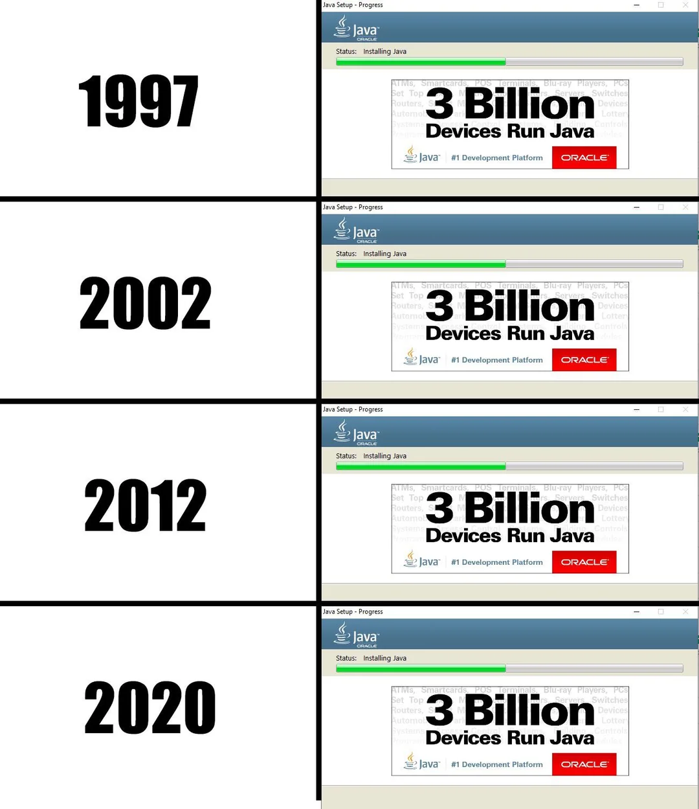
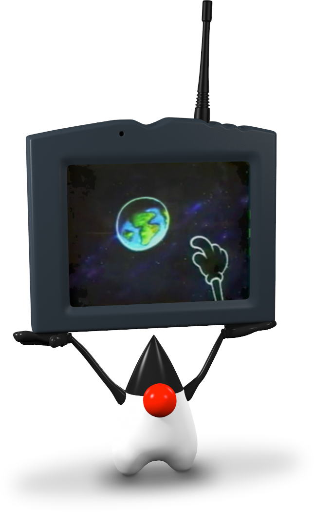
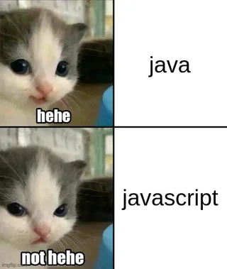

# The Java Journey: From Interactive TVs to Interplanetary Missions

>“Write once, run anywhere” — Java’s promise that shaped the digital world.

_Estimated reading time: 15-17 minutes_

## Introduction

Java is everywhere—from the apps on your phone to servers powering the internet, and even in space missions. Originally developed in the early 1990s for interactive television, Java has evolved into one of the most reliable and versatile programming languages.

In this article, we’ll take a walk through Java’s fascinating journey—from its humble beginnings with the Green Team to becoming a cornerstone of enterprise development, Android apps, and even NASA projects.

## Java History

<figure>
  
  <figcaption>Source: <a href="https://www.reddit.com/r/ProgrammerHumor/comments/g62qm7/java_evolution_through_the_years/" target="_blank">leontin91 @ r/ProgrammerHumour</a></figcaption>
</figure>

### 1991: The Green Team, Green project and Project Oak

Java began as a project (Greeb project) in 1991 at Sun Microsystems by a team of researchers called `The Green Team` to create a new language for the set-top box project (interactive television):
- James Gosling (leader) ([https://www.linkedin.com/in/jamesgosling](https://www.linkedin.com/in/jamesgosling))
- Mike Sheridan (member)
- Patrick Naughton (member)

The team initially considered using C++, but they found it too complex and unsuitable for embedded systems. This led them to create a new language that was simple, platform-independent, and secure.

Their first prototype was a scripting language called `GreenTalk`, with files using the `.gt` extension. GreenTalk served as an internal proof of concept—a way to experiment with platform-agnostic programming.

As the project matured, the language was renamed `Oak`, a name proposed by James Gosling. The inspiration came from an oak tree outside his office. The oak was chosen not only for personal significance but also because it symbolizes strength and endurance, and is recognized as a national tree in countries like the U.S., France, Germany, and Romania.

### 1992: The First Demo - Star7 and the birth of mascot `Duke`

<figure>
  
  <figcaption>Source: <a href="https://wiki.openjdk.org/display/duke/Gallery" target="_blank">https://wiki.openjdk.org/display/duke/Gallery</a></figcaption>
</figure>

in 1992 the team created its first working demo, an interactive handheld home entertainment controller called the `Star7` (see [video](https://www.youtube.com/watch?v=1CsTH9S79qI)). At the heart of the animated touch-screen user interface was a cartoon character named `Duke` (wichi will become the mascot of java).

Duke was created by one of the team’s graphic artists, Joe Palrang. Joe went on to work on popular animated movies such as Shrek, Over the Hedge, and Flushed Away.

Duke was designed to represent a "software agent" that performed tasks for the user. Duke was the interactive host that enabled a new type of user interface that went beyond the buttons, mice, and pop-up menus of the desktop computing world.

Duke was instantly embraced. In fact, at about the same time Java was first introduced and the first Java cup logo was commissioned, Duke became the official mascot of Java technology. In 2006, Duke was officially "open sourced" under a BSD license.

read more about duke in [https://dev.java/duke/](https://dev.java/duke/)

### 1993: `First Person` and the Missed Opportunity with `Time Warner`

In 1993, the Green Team took a significant step by forming a subsidiary company under Sun Microsystems called First Person, Inc.. The goal was to commercialize their platform-independent technology, initially intended for interactive television systems.

First Person responded to a Request for Proposal (RFP) from [Time warmer](https://en.wikipedia.org/wiki/WarnerMedia) (an American multinational mass media and entertainment conglomerate), which was looking for technology to build an interactive cable television system But it didn’t succeed in securing this deal with Time Warner. Since the project didn't succeed, the subsidiary (First Person) was dissolved or reintegrated into the main Sun Microsystems organization.

After this, the team shifted its focus away from interactive TV and instead started working on online services, city rooms, and desktops

### 1994–1995: A New Niche, A New Name, and A Public Reveal

At that time, the web was largely static—web pages consisted mainly of text and images. JavaScript had not yet been released (it would debut in 1995), so there was no native way to add interactivity or animation to websites.

The team realized that Oak could be used to create dynamic and interactive web pages that could run on any browser that supported a JVM. They created a prototype browser called WebRunner (named as a nod to the film Blade Runner), later renamed [HotJava](https://en.wikipedia.org/wiki/HotJava) (1995-1999), that could execute Oak applets (small programs) embedded in HTML pages. They also decided to rename Oak to Java because oak was already trademarked. Why java ? inspired by the team’s love for coffee, particularly Java coffee from the Indonesian island called Java.

In May 23, 1995, Sun Microsystems officially announced Java at the SunWorld conference presenting it as a revolutionary, cross-platform programming language with the motto:

> "Write Once, Run Anywhere."

The same year, Netscape Communications (makers of the most popular browser at the time) announced native support for Java. This gave Java immense visibility and momentum, allowing applets to reach millions of users via the web.

Time magazine called Java one of the Ten Best Products of 1995.

> 7. JAVA Neither island nor coffee, this miniaturized programming language from Sun Microsystems can add sparkle and interactivity to the most sluggish home page on the World Wide Web, the fastest growing part of the Internet. Rivals--IBM, Microsoft and even Netscape--have all agreed to adopt it as a kind of Esperanto of the net.

source: [https://content.time.com/time/subscriber/article/0,33009,983903,00.html](https://content.time.com/time/subscriber/article/0,33009,983903,00.html)

#### NOTE: java vs javascript

<figure>
  
  <figcaption>Source: <a href="https://www.reddit.com/r/ProgrammerHumor/comments/1gy88sq/thescriptchangeseverything/" target="_blank">BastianToHarry @ r/ProgrammerHumour</a></figcaption>
</figure>

Despite the similarity in names, the JavaScript language that was designed to run in Web browsers is not part of Java. JavaScript was developed in 1995 at Netscape Communications Corp. and was conceived of as a companion to Java. It was originally called Mocha and then LiveScript before Netscape received a marketing license from Sun.

### 1996: first official release

In 1996, Java 1.0 was officially released, marking the language's transition from a promising prototype to a widely adopted development platform.

With its revolutionary promise of "Write Once, Run Anywhere" (WORA), Java quickly became a cornerstone of web programming. Developers could now write code on one system and expect it to run on any other device equipped with a Java Virtual Machine (JVM)—regardless of underlying hardware or operating system.

### 1997-1989: Formalizing the Language & the Birth of JCP

By 1997, Java's popularity was growing rapidly, and Sun Microsystems recognized the need for a more collaborative and structured approach to evolve the platform. This led to the creation of the [`Java Community Process (JCP)`](https://jcp.org/).

> The JCP is the mechanism for developing standard technical specifications for Java technology. Anyone can register for the site and participate in reviewing and providing feedback for the Java Specification Requests (JSRs), and anyone can sign up to become a JCP Member and then participate on the Expert Group of a JSR or even submit their own JSR Proposals. - source: <https://jcp.org/en/home/index>

Each proposal for a new feature or API in Java is submitted as a `Java Specification Request (JSR)`. These JSRs undergo community review, implementation, and approval through voting. (see al JSRs at: [https://jcp.org/en/jsr/all](https://jcp.org/en/jsr/all))

However, Java still lacked official recognition by formal standardization bodies such as:
- Ecma International
- ISO/IEC JTC 1
- ANSI

In fact, in 1997, Sun approached both ISO/IEC and Ecma International to standardize Java but withdrew from the process shortly after. The decision was driven by Sun's desire to maintain tight control over the platform’s evolution, ensuring consistency and compatibility across implementations.

As a result, Java became a de facto standard—its official reference implementation being governed not by international bodies, but by Sun (and later Oracle) via the Java Community Process.

### 1998: 3 different editions of java

In December 1998, Sun Microsystems released `J2SE 1.2`, a significant update to the Java platform that introduced key enhancements such as the Swing GUI toolkit and Collections Framework. But most importantly, it marked the beginning of platform-specific configurations of Java to serve different computing needs.

To address the growing variety of hardware and software environments, Java was officially divided into three editions:

| Edition                   | Purpose                                                      |
| ------------------------- | ------------------------------------------------------------ |
| J2SE (Standard Edition)   | For desktop and general-purpose applications                 |
| J2EE (Enterprise Edition) | For large-scale, distributed, server-side enterprise apps    |
| J2ME (Micro Edition)      | For resource-constrained devices (mobile phones, PDAs, etc.) |

In 2006, for marketing purposes, Sun renamed new J2 versions as Java EE, Java ME, and Java SE, respectively.

After Oracle’s acquisition of Sun in 2010, stewardship of Java EE was eventually transferred to the Eclipse Foundation in 2017.
Due to trademark restrictions on the name “Java” (owned by Oracle), Java EE was officially renamed to `Jakarta EE` in 2018.
Jakarta EE continues the legacy of Java EE as an open-source platform for building enterprise applications in Java.

### 2004: J2SE 5.0 (Tiger) Game Changer For Java

J2SE 5.0 (Tiger 🐅) came with game-changing features like generics, enhanced for-each loops, auto-boxing/unboxing, and annotations. This was a leap towards making Java more developer-friendly and enhancing developer productivity.

In 2004, J2SE 5.0, codenamed Tiger, introduced some of the most impactful enhancements to the Java language since its creation. some of them are:

| feature                 | description                                                  |
| ----------------------- | ------------------------------------------------------------ |
| Generics                | Type-safe collections and better compile-time checks         |
| Enhanced for-each loops | Cleaner iteration syntax (for (Item item : list))            |
| Autoboxing / Unboxing   | Automatic conversion between primitives and wrapper classes  |
| Annotations             | Metadata tags for code, paving the way for modern frameworks |

These features drastically improved developer productivity, code readability, and maintainability—making Java more expressive and modern

### 2006: Java Goes Open Source

In 2006, Sun Microsystems announced that Java’s core components specifically the Java Class Library and Java Compiler—would be released as open source under the GNU General Public License v2 (GPLv2).

This led to the creation of `OpenJDK (Open Java Development Kit)`, which remains the official reference implementation of Java to this day.

This move positioned Java more firmly in the open-source ecosystem and helped it thrive in Linux distributions and community projects.

### 2009: Oracle Acquires Sun Microsystems

In 2009, Oracle Corporation acquired Sun Microsystems, and with it, took over stewardship of the Java platform, MySQL, and other technologies.

From this point forward, Oracle became the primary driver of Java’s evolution—overseeing the JDK, the Java Community Process (JCP), and the official licensing.

### 2017: Java 9 (Java SE 9) and Oracle's New Release Cycle/Cadence

Oracle introduced a new time-driven release model, with Java versions being released every six months.
Java SE 9 introduced the Java Platform Module System (Project Jigsaw), which modularized the JDK and allowed developers to create modular applications.

In 2017, Java SE 9 was released with two major shifts:
1. Java 9 introduced the Java Platform Module System, allowing developers to: Split applications into independent modules, Improve encapsulation and runtime performance and Create smaller, custom JDK runtimes using jlink
2. Oracle introduced a time-driven release cycle, committing to a new Java release every six months, instead of waiting for major feature milestones. This is an attempt to keep the ecosystem modern and evolving quickly

## Java Is Everywhere

From powering the biggest games to space exploration, Java has found its place in nearly every area of software development. Its cross-platform nature and rich ecosystem have made it one of the most widely adopted languages in the world.

| AREA                 | Description                                                                                                                                                                                                                                                  |
| -------------------- | ------------------------------------------------------------------------------------------------------------------------------------------------------------------------------------------------------------------------------------------------------------ |
| Games                | The world-famous game Minecraft was originally developed in Java. Its modding community thrives thanks to Java’s readability and flexibility. It introduced an entire generation of young developers to programming.                                         |
| Space                | Java is used in NASA software and mission control systems. NASA's WorldWind SDK, used for 3D visualization of Earth and other planets, was built in Java. NASA also lists Java-tagged projects on its [open-source portal](https://code.nasa.gov/?tag=java). |
| Mobile               | Android apps are predominantly written in Java (and Kotlin, which runs on the JVM), Java APIs form the core of Android’s SDK, making it the gateway to billions of mobile devices.                                                                           |
| Enterprise & Servers | Java is a backbone of enterprise applications thanks to Java EE (now Jakarta EE) Major corporations use Java for banking, e-commerce, cloud platforms, and big data pipelines.                                                                               |
| IoT, Cards, and More | Java runs on smart cards, set-top boxes, automotive systems, and embedded devices. Technologies like Java Card allow secure communication and identity verification in SIM cards and payment systems.                                                        |

## resources

- https://smartprogramming.in/tutorials/java/history-of-java
- https://dl.acm.org/doi/pdf/10.1145/1016998.1017013

## Want to Start Coding in Java?

Now that you've explored Java's rich history and evolution, why not take your first step into the beautiful world of Java development?

Here’s how to get started:

After knowing the history of Java take a step into the beutiful world of java

1. Download the JDK from the official source, there ara many vendors that you can chose from:
    - oracle at https://www.oracle.com/java/technologies/downloads
    - openjdk at https://jdk.java.net/archive/
    - amazon at https://aws.amazon.com/corretto
    - and many more
2. Explore tutorials and documentation at: <https://dev.java>
3. Star or contribute to this article on GitHub: <https://github.com/el-amine-404/articles>

## Note from the Author

As a passionate Java developer, I love sharing what I’ve learned and giving back to the community. That’s why I decided to write this article—to help others discover and appreciate the beauty and power of the Java language.

This article is:

- Open-source on GitHub
- Open for contributions — found a typo? Want to add something? You're welcome to submit a pull request!
- you enjoyed the article, star the repo and consider sharing it with friends, colleagues, or developer communities!

➡️ [View or edit this article on GitHub](https://github.com/el-amine-404/articles)
